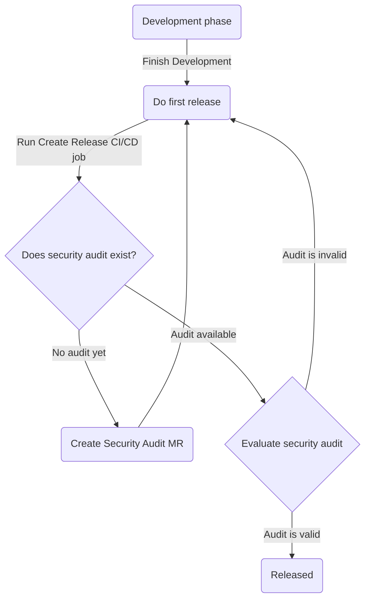

# Security Audit

Catladder pipeline's job `create release` contains a step which requires projects to contain security audit document (SECURITY.md).

The document contains basic information about security posture of a project that brings transparency, allows us to quickly react in case of security emergency and create awareness towards security of apps we build.

The document is created from a template automatically when detected a missing file.

Release flow is following:



- `Run Create Release CI/CD job`: a developer clicks a button (create release) in Gitlab pipeline
- `No audit yet`: if `SECURITY.md` does not exist yet or in other words Security Audit MR is not merged yet
- `Audit is invalid`: if `SECURITY.md` table has zero topics answered - does not have responsible and is answered with placeholder value (✅/❌)

## Security audit commands

The security audit commands are part of the `catladder` CLI:

```bash
catladder security audit evaluate <path>
catladder security audit create <token> <mainBranch> <projectId> <userId>
catladder security audit ci-job <path> <token> <mainBranch> <projectId> <userId>
```

These commands can also be used non-interactively in CI/CD pipelines.

## FAQ

### Why can't I create release?

Pipeline job shows errors:
```
doing security audit check
could not evaluate security audit document
creating new merge request with security audit template...
security audit merge request created successfully
please finish the MR by updating SECURITY.md document: https://git.panter.ch/.../-/merge_requests/14
```

`No audit yet`

**New MR was created containing security audit template which needs to be filled in by a developer and merged. Otherwise creating a release is not allowed.**


Pipeline job shows errors:
```
$ semanticRelease
doing security audit check
audit document has no answered topics
please answer security topics in SECURITY.md by adding responsible people and check/cross in the table
```

`Audit is invalid`

**Security audit document (`SECURITY.md`) contains a table that needs to have at least one answer - either ✅ or ❌ (but not ✅/❌) and responsible person. Otherwise creating a release is not allowed.**

After filling in the audit document you should see something like this in create release job:
```
$ semanticRelease
doing security audit check
Project security posture overview:
 🧐 Total topics: 21
 🔒 Secured topics: 12
 📢 Answered topics: 21
 ❔ Unknown topics: 0
 📊 Rating: 🟨 57/100
doing semantic release
...
```

---

### Who can I ask for help with security audit?

1. Follow guide links for each security topic
2. Ask on Circle Security channel
3. Use LLMs (ChatGPT) **in moderation** without providing sensitive information about a project (e.g. project name, url, company behind, anything that could be used by bad actors when ChatGPT has a data leak)

### How SECURITY.md should look?

Example of filled security audit document (SECURITY.md) is below. The most important are information from the table with security topics. Guide links of the document template are available in: https://git.panter.ch/panter/security-guide


SECURTY.md
---

# Security Audit Report

A security audit report document is a comprehensive assessment of an application's security posture, containing security topics that auditors can mark to indicate the state of various security aspects.

It serves as a structured guide for security team to evaluate different security factors such as authentication, authorization, data encryption, input validation, and more.

## General Information

- Project Owner is @project-owner-gitlab-tag
- Dev team:
  - @dev1-gitlab-tag
  - @dev2-gitlab-tag
  - @...

## Project Security

| Responsible | ✅/❌ | Description                                     | Note             | More information              |
| ----------- | ----- | ----------------------------------------------- | ---------------- | ----------------------------- |
| @dev1       | ✅    | No API keys or secrets are stored in repository |                  | [guide](https://rickroll.it/) |
| @dev2       | ❌    | The app does not provide password login         | Work in progress |                               |
| @dev3       | ❌    | Passwords are not stored                        |                  | [guide](https://rickroll.it/) |
... more rows ...
